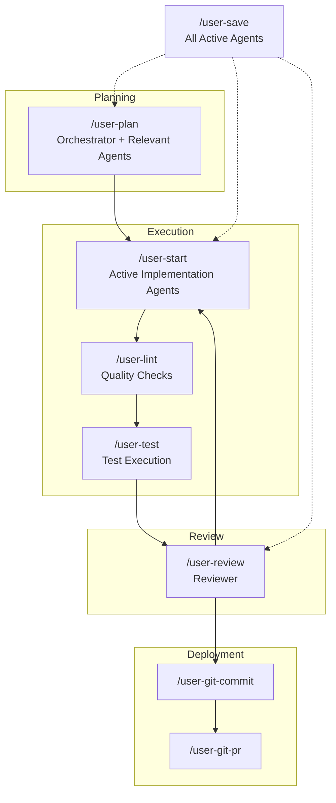

# AI Configuration

A sophisticated multi-agent command system for AI-assisted development workflows, built on Claude Code's extensible architecture.

## 📋 Overview

This project provides a comprehensive set of [Claude Code](https://www.anthropic.com/claude-code) commands that implement multi-agent workflows for software development, including planning, execution, code review, and documentation management. The system uses [GNU Stow](https://www.gnu.org/software/stow/) for deployment and provides opinionated tool restrictions for optimal performance.

## 🚀 Quick Start

### Installation

```sh
# Clone the repository
git clone <repository-url> ai-config
cd ai-config

# Install using Stow (deploys to $HOME)
just install
```

**Note on Configuration Directory**: This project uses XDG-compliant paths (`~/.config/claude`). Since Claude Code reverted to using `~/.claude` as the default, you have two options:
1. Manually copy the configuration from `claude/.config/claude/` to `$HOME/.claude/`
2. Set `CLAUDE_CONFIG_DIR` in your shell configuration

```bash
export CLAUDE_CONFIG_DIR="$HOME/.config/claude"
```

For more details, see [Claude Code Issue #1455](https://github.com/anthropics/claude-code/issues/1455)

### Available Commands

```sh
# Show all available commands
just --list

# Install configuration
just install
```

## 📚 Command Reference

### 🧩 Planning and Architecture
- **`/user-plan`** - Multi-agent research and execution planning
- **`/user-review`** - Comprehensive pre-PR review with specialized agents
- **`/user-save`** - Session continuity and state management

### ⚙️ Development Workflow
- **`/user-start`** - Begin execution from tasks.md
- **`/user-lint`** - Language-specific linting (Python, Go, TypeScript, SQL, Terraform)
- **`/user-test`** - Intelligent test execution with focused scope
- **`/user-git-commit`** - Logical commit creation with conventional commits
- **`/user-git-pr`** - GitHub PR creation with automated descriptions

### 📊 Documentation Management
- **`/user-docs-update`** - Keep documentation current with code changes
- **`/user-docs-refactor`** - Restructure and improve documentation
- **`/user-rules-update`** - Update coding patterns and rules

## 🤖 Specialized Sub-Agents

Final consolidated set of sub-agents (5 roles):

### 📋 Planning & Orchestration
- **[Orchestrator](claude/.config/claude/agents/orchestrator.md)** — Defines requirements and coordinates execution
  - Creates comprehensive `requirements.md` and acceptance criteria
  - Manages cross-team dependencies and timelines
  - Ensures smooth handoffs and quality gates

### 🔨 Execution
- **[Backend Engineer](claude/.config/claude/agents/backend-engineer.md)** — Server-side logic, APIs, data pipelines, and infrastructure
  - Python/Go/TypeScript services; REST/GraphQL endpoints
  - Data engineering with Polars; orchestration with Temporal
  - Infrastructure-as-code with Terraform across AWS/GCP/Azure

- **[Frontend Engineer](claude/.config/claude/agents/frontend-engineer.md)** — User interfaces with React/TypeScript
  - Responsive, accessible UI components
  - State management and API integration

- **[Machine Learning Engineer](claude/.config/claude/agents/ml-engineer.md)** — Model development and deployment
  - Training pipelines and experiments
  - Inference performance and deployment

### 🔍 Review
- **[Reviewer](claude/.config/claude/agents/reviewer.md)** — QA, Code Review, and Security
  - Validates requirements, quality, and security in a single pass
  - Produces a consolidated report and remediation plan

## 🔄 Multi-Agent Development Workflow

### Planning Process (`/user-plan`)
1. **[Orchestrator](claude/.config/claude/agents/orchestrator.md)** creates requirements.md
2. System identifies which implementation agents are needed
3. Only relevant agents create execution plans in `.claude/tasks/[agent-name]-tasks.md`
4. **[Orchestrator](claude/.config/claude/agents/orchestrator.md)** synthesizes plans and identifies dependencies

### Execution Process (`/user-start`)
1. Reads root `tasks.md` to identify active agents
2. Deploys only the agents working on current project
3. **[Orchestrator](claude/.config/claude/agents/orchestrator.md)** manages dependencies and parallel execution
4. Agents work independently on their task lists

### Review Process (`/user-review`)
Deploys the consolidated Reviewer:
- **[Reviewer](claude/.config/claude/agents/reviewer.md)** validates functionality, code quality, and security

Findings are synthesized into tasks for implementation agents.

### State Management (`/user-save`)
All active agents update their task lists with:
- Current progress and completion status
- Technical decisions made
- Blockers and dependencies
- New tasks discovered

## 🔄 Primary Development Workflow



## 🛠️ Tool Integration

### Supported Languages and Tools
- **Python**: `ruff`, `pyright`, `pytest`
- **Go**: `golangci-lint`, `go vet`, `go fmt`
- **TypeScript**: `eslint`, `vitest`, `tsc`
- **SQL**: `sqlfluff`
- **Terraform**: `terraform validate`

### External Integrations
- **GitHub**: PR creation and repository operations
- **Linear MCP**: Issue tracking and project management
- **Sentry MCP**: Error tracking and monitoring

## ⚙️ Configuration

### Command Tools
Each command defines minimal tools in frontmatter using a single `tools:` line (comma‑separated):

| Command | Purpose | Tools | Active Agents |
|---------|---------|-------|---------------|
| user-plan | Requirements & planning | Agent, Glob, Grep, Read, TodoWrite, WebFetch | Orchestrator (requirements), relevant agents |
| user-start | Task execution | Agent, Read, TodoRead, TodoWrite | Only agents listed in root tasks.md |
| user-lint | Code quality | Bash, Grep, LS, Read | Direct execution (no agents) |
| user-test | Testing | Bash, Grep, LS, Read | Direct execution (no agents) |
| user-review | Code review | Agent, Bash, Grep, LS, Read, TodoRead, TodoWrite | Reviewer |
| user-save | Progress tracking | Agent, Read, TodoRead, TodoWrite | All active agents from tasks.md |

## 🏗️ Architecture

### Configuration Management
```text
ai-config/
├── justfile                    # Build automation
├── tasks.md                    # Root task registry (audits, summaries)
├── .stowrc                     # Stow configuration
├── .editorconfig              # Editor standards
├── .vscode/settings.json      # VS Code configuration
├── .claude/                   # Project-scoped runtime state
│   └── tasks/                 # Distributed task lists per agent
│       ├── backend-engineer-tasks.md
│       ├── frontend-engineer-tasks.md
│       ├── ml-engineer-tasks.md
│       ├── orchestrator-tasks.md
│       └── reviewer-tasks.md
└── claude/.config/claude/     # Claude Code configuration
    ├── settings.json
    ├── commands/              # Command definitions
    └── agents/                # Sub-agent definitions
```

### Multi-Agent Coordination
The system implements sophisticated patterns for agent collaboration:

- **Selective Deployment** - Only agents relevant to the work are activated
- **Distributed Task Management** - Each agent maintains their own task list
- **Parallel Execution** - Agents work simultaneously when dependencies allow
- **Cross-Domain Coordination** - Orchestrator manages handoffs and dependencies
- **Clear Boundaries** - Each agent has exclusive authority over their domain:
  - Only [Backend Engineer](claude/.config/claude/agents/backend-engineer.md) builds ETL pipelines and provisions infrastructure
  - Only [Backend Engineer](claude/.config/claude/agents/backend-engineer.md) owns API documentation
  - Reviewer has read-only access

## 🤝 Contributing

This project follows conventional commits and uses the integrated review system:

1. Plan changes with `/user-plan`
2. Execute with `/user-start`
3. Review with `/user-review`
4. Commit with `/user-git-commit`
5. Create PR with `/user-git-pr`
