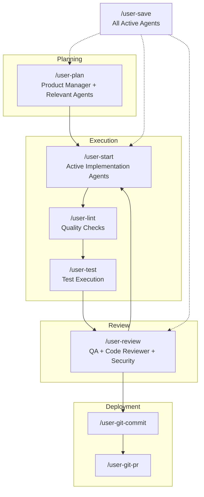

# AI Configuration

A sophisticated multi-agent command system for AI-assisted development workflows, built on Claude Code's extensible architecture.

## 📋 Overview

This project provides a comprehensive set of [Claude Code](https://www.anthropic.com/claude-code) commands that implement multi-agent workflows for software development, including planning, execution, code review, and documentation management. The system uses [GNU Stow](https://www.gnu.org/software/stow/) for deployment and provides opinionated tool restrictions for optimal performance.

## 🚀 Quick Start

### Installation

```sh
# Clone the repository
git clone <repository-url> ai-config
cd ai-config

# Install using Stow (deploys to $HOME)
just install
```

### Available Commands

```sh
# Show all available commands
just --list

# Install configuration
just install
```

## 📚 Command Reference

### 🧩 Planning and Architecture
- **`/user-plan`** - Multi-agent research and execution planning
- **`/user-review`** - Comprehensive pre-PR review with specialized agents
- **`/user-save`** - Session continuity and state management

### ⚙️ Development Workflow
- **`/user-start`** - Begin execution from tasks.md
- **`/user-lint`** - Language-specific linting (Python, Go, TypeScript, SQL, Terraform)
- **`/user-test`** - Intelligent test execution with focused scope
- **`/user-git-commit`** - Logical commit creation with conventional commits
- **`/user-git-pr`** - GitHub PR creation with automated descriptions

### 📊 Documentation Management
- **`/user-docs-update`** - Keep documentation current with code changes
- **`/user-docs-refactor`** - Restructure and improve documentation
- **`/user-rules-update`** - Update coding patterns and rules

## 🤖 Specialized Sub-Agents

The system employs 10 specialized sub-agents, each with specific expertise and tool access:

### 📋 Planning Stage
- **[Product Manager](claude/.config/claude/agents/product-manager.md)** - Translates business requirements into technical specifications
  - Creates comprehensive `requirements.md` documentation
  - Defines acceptance criteria and scope
  - Breaks down requirements by technical domain

- **[Orchestrator](claude/.config/claude/agents/orchestrator.md)** - Coordinates information flow and task delegation between agents
  - Manages cross-team dependencies
  - Creates unified project timelines
  - Ensures smooth handoffs between teams

### 🔨 Execution Stage
- **[Backend Engineer](claude/.config/claude/agents/backend-engineer.md)** - Develops server-side logic, APIs, and data models
  - Implements using Python, Go, or TypeScript
  - Creates RESTful and GraphQL endpoints
  - Manages database schemas and business logic

- **[Frontend Engineer](claude/.config/claude/agents/frontend-engineer.md)** - Builds user interfaces with React and TypeScript
  - Creates responsive, accessible UI components
  - Implements state management and API integration
  - Ensures optimal user experience

- **[Infrastructure Engineer](claude/.config/claude/agents/infra-engineer.md)** - Provisions and manages cloud infrastructure
  - Uses Terraform exclusively for IaC
  - Manages AWS, GCP, and Azure resources
  - Implements security and scaling strategies

- **[Data Engineer](claude/.config/claude/agents/data-engineer.md)** - Builds ETL pipelines for data processing
  - Uses Python with Polars for transformations
  - Implements Temporal workflows for orchestration
  - Manages data warehouse integrations

- **[Machine Learning Engineer](claude/.config/claude/agents/ml-engineer.md)** - Develops and deploys ML models
  - Uses PyTorch and Hugging Face frameworks
  - Designs training pipelines and experiments
  - Optimizes model performance and deployment

### 🔍 Review Stage
- **[QA](claude/.config/claude/agents/qa.md)** - Tests functionality against requirements
  - Validates acceptance criteria
  - Identifies defects and missing features
  - Ensures quality user experience

- **[Code Reviewer](claude/.config/claude/agents/code-reviewer.md)** - Reviews code for quality and best practices
  - Identifies logic errors and performance issues
  - Ensures adherence to coding standards
  - Focuses on maintainability and architecture

- **[Security Engineer](claude/.config/claude/agents/security-engineer.md)** - Analyzes security vulnerabilities
  - Scans for OWASP Top 10 vulnerabilities
  - Reviews authentication and authorization
  - Ensures compliance with security standards

## 🔄 Multi-Agent Development Workflow

### Planning Process (`/user-plan`)
1. **[Product Manager](claude/.config/claude/agents/product-manager.md)** creates requirements.md
2. System identifies which implementation agents are needed
3. Only relevant agents create execution plans in `.claude/tasks/[agent-name]-tasks.md`
4. **[Orchestrator](claude/.config/claude/agents/orchestrator.md)** synthesizes plans and identifies dependencies

### Execution Process (`/user-start`)
1. Reads root `tasks.md` to identify active agents
2. Deploys only the agents working on current project
3. **[Orchestrator](claude/.config/claude/agents/orchestrator.md)** manages dependencies and parallel execution
4. Agents work independently on their task lists

### Review Process (`/user-review`)
Deploys all three review agents in parallel:
- **[QA](claude/.config/claude/agents/qa.md)** tests against requirements
- **[Code Reviewer](claude/.config/claude/agents/code-reviewer.md)** analyzes code quality
- **[Security Engineer](claude/.config/claude/agents/security-engineer.md)** scans for vulnerabilities

Findings are synthesized into tasks for implementation agents.

### State Management (`/user-save`)
All active agents update their task lists with:
- Current progress and completion status
- Technical decisions made
- Blockers and dependencies
- New tasks discovered

## 🔄 Primary Development Workflow



## 🛠️ Tool Integration

### Supported Languages and Tools
- **Python**: `ruff`, `pyright`, `pytest`
- **Go**: `golangci-lint`, `go vet`, `go fmt`
- **TypeScript**: `eslint`, `vitest`, `tsc`
- **SQL**: `sqlfluff`
- **Terraform**: `terraform validate`

### External Integrations
- **GitHub**: PR creation and repository operations
- **Linear MCP**: Issue tracking and project management
- **Sentry MCP**: Error tracking and monitoring

## ⚙️ Configuration

### Command Tool Restrictions
Each command is optimized with minimal necessary tools:

| Command | Purpose | Allowed Tools | Active Agents |
|---------|---------|---------------|---------------|
| user-plan | Requirements & planning | Read, Glob, Grep, Task, TodoWrite, WebFetch | Product Manager, Relevant Implementation Agents, Orchestrator |
| user-start | Task execution | Read, Task, TodoWrite, TodoRead | Only agents listed in root tasks.md |
| user-lint | Code quality | Bash, LS, Grep | Direct execution (no agents) |
| user-test | Testing | Bash, LS, Grep, Read | Direct execution (no agents) |
| user-review | Code review | Read, Glob, Grep, Task, Bash, TodoRead, TodoWrite | QA, Code Reviewer, Security Engineer |
| user-save | Progress tracking | Read, Task, TodoRead, Write | All active agents from tasks.md |

## 🏗️ Architecture

### Configuration Management
```text
ai-config/
├── justfile                    # Build automation
├── tasks.md                    # Root task registry (active agents)
├── .stowrc                     # Stow configuration
├── .editorconfig              # Editor standards
├── .vscode/settings.json      # VS Code configuration
└── claude/                    # Claude Code configuration
    ├── tasks/                 # Distributed task lists
    │   ├── backend-engineer-tasks.md
    │   ├── frontend-engineer-tasks.md
    │   ├── infra-engineer-tasks.md
    │   ├── data-engineer-tasks.md
    │   ├── ml-engineer-tasks.md
    │   ├── qa-tasks.md
    │   ├── code-reviewer-tasks.md
    │   └── security-engineer-tasks.md
    └── .config/claude/
        ├── settings.json      # Global settings
        ├── commands/          # Command definitions
        └── agents/            # Sub-agent definitions
```

### Multi-Agent Coordination
The system implements sophisticated patterns for agent collaboration:

- **Selective Deployment** - Only agents relevant to the work are activated
- **Distributed Task Management** - Each agent maintains their own task list
- **Parallel Execution** - Agents work simultaneously when dependencies allow
- **Cross-Domain Coordination** - Orchestrator manages handoffs and dependencies
- **Clear Boundaries** - Each agent has exclusive authority over their domain:
  - Only [Data Engineer](claude/.config/claude/agents/data-engineer.md) builds ETL pipelines
  - Only [Infrastructure Engineer](claude/.config/claude/agents/infrastructure-engineer.md) provisions resources
  - Only [Backend Engineer](claude/.config/claude/agents/backend-engineer.md) owns API documentation
  - Review agents have read-only access

## 🤝 Contributing

This project follows conventional commits and uses the integrated review system:

1. Plan changes with `/user-plan`
2. Execute with `/user-start`
3. Review with `/user-review`
4. Commit with `/user-git-commit`
5. Create PR with `/user-git-pr`