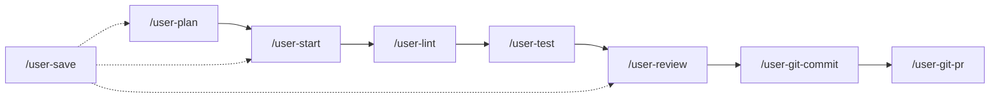

# AI Configuration

A sophisticated multi-agent command system for AI-assisted development workflows, built on Claude Code's extensible architecture.

## 📋 Overview

This project provides a comprehensive set of [Claude Code](https://www.anthropic.com/claude-code) commands that implement multi-agent workflows for software development, including planning, execution, code review, and documentation management. The system uses [GNU Stow](https://www.gnu.org/software/stow/) for deployment and provides opinionated tool restrictions for optimal performance.

## 🚀 Quick Start

### Installation

```sh
# Clone the repository
git clone <repository-url> ai-config
cd ai-config

# Install using Stow (deploys to $HOME)
just install
```

### Available Commands

```sh
# Show all available commands
just --list

# Install configuration
just install
```

## 📚 Command Reference

### 🧩 Planning and Architecture
- **`/user-plan`** - Multi-agent research and execution planning
- **`/user-review`** - Comprehensive pre-PR review with specialized agents
- **`/user-save`** - Session continuity and state management

### ⚙️ Development Workflow
- **`/user-start`** - Begin execution from tasks.md
- **`/user-lint`** - Language-specific linting (Python, Go, TypeScript, SQL, Terraform)
- **`/user-test`** - Intelligent test execution with focused scope
- **`/user-git-commit`** - Logical commit creation with conventional commits
- **`/user-git-pr`** - GitHub PR creation with automated descriptions

### 📊 Documentation Management
- **`/user-docs-update`** - Keep documentation current with code changes
- **`/user-docs-refactor`** - Restructure and improve documentation
- **`/user-rules-update`** - Update coding patterns and rules

## 🤖 Multi-Agent Workflows

### Planning Process (`/user-plan`)
Deploys 4 specialized agents in parallel:
- **Architecture Agent** - Analyzes project structure and patterns
- **Implementation Agent** - Researches existing code and solutions
- **Testing Agent** - Identifies testing requirements and strategies
- **Documentation Agent** - Discovers relevant documentation and patterns

### Review Process (`/user-review`)
Conducts comprehensive analysis with 3 specialized agents:
- **Code Quality Agent** - Logic bugs, performance, architecture
- **Security Agent** - Vulnerabilities, credentials, access control
- **Best Practices Agent** - Language conventions, patterns, documentation

### Git Integration (`/user-git-commit`)
Employs 3 analysis agents for commit optimization:
- **Grouping Agent** - Logical change grouping
- **Sequencing Agent** - Optimal commit ordering
- **Type Agent** - Conventional commit classification

## 🔄 Primary Development Workflow



## 🛠️ Tool Integration

### Supported Languages and Tools
- **Python**: `ruff`, `pyright`, `pytest`
- **Go**: `golangci-lint`, `go vet`, `go fmt`
- **TypeScript**: `eslint`, `vitest`, `tsc`
- **SQL**: `sqlfluff`
- **Terraform**: `terraform validate`

### External Integrations
- **GitHub**: PR creation and repository operations
- **Linear MCP**: Issue tracking and project management
- **Sentry MCP**: Error tracking and monitoring

## ⚙️ Configuration

### Command Tool Restrictions
Each command is optimized with minimal necessary tools:

| Command | Purpose | Allowed Tools |
|---------|---------|---------------|
| user-plan | Research & planning | Read, Glob, Grep, Agent, TodoWrite, WebFetch |
| user-start | Task execution | Read, TodoWrite, TodoRead, Bash, Edit, MultiEdit, Write |
| user-lint | Code quality | Bash, LS, Grep |
| user-test | Testing | Bash, LS, Grep, Read |
| user-review | Code review | Read, Glob, Grep, Agent, Bash, TodoRead |

## 🏗️ Architecture

### Configuration Management
```text
ai-config/
├── justfile                    # Build automation
├── tasks.md                    # Central task planning
├── .stowrc                     # Stow configuration
├── .editorconfig              # Editor standards
├── .vscode/settings.json      # VS Code configuration
└── claude/                    # Claude Code configuration
    └── .config/claude/
        ├── settings.json      # Global settings
        └── commands/          # Command definitions
```

### Multi-Agent Coordination
Commands implement sophisticated multi-agent patterns:
- **Parallel Agent Deployment** - Multiple agents work simultaneously
- **Agent Specialization** - Domain-specific expertise
- **Result Synthesis** - Unified findings compilation
- **Coordinated Decision Making** - Collaborative recommendations

## 🤝 Contributing

This project follows conventional commits and uses the integrated review system:

1. Plan changes with `/user-plan`
2. Execute with `/user-start`
3. Review with `/user-review`
4. Commit with `/user-git-commit`
5. Create PR with `/user-git-pr`