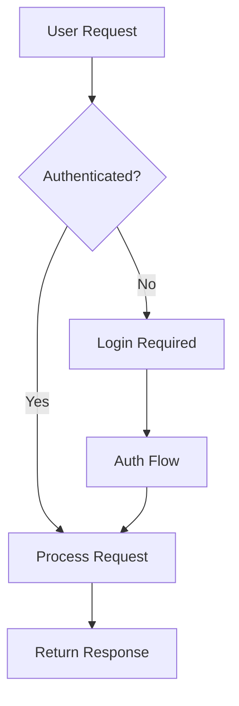
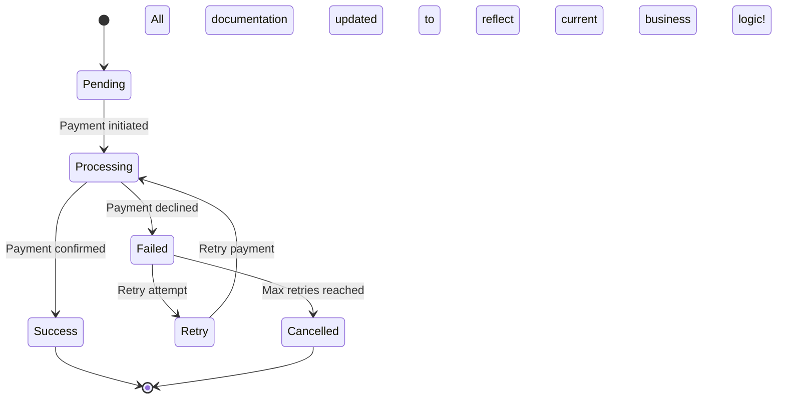
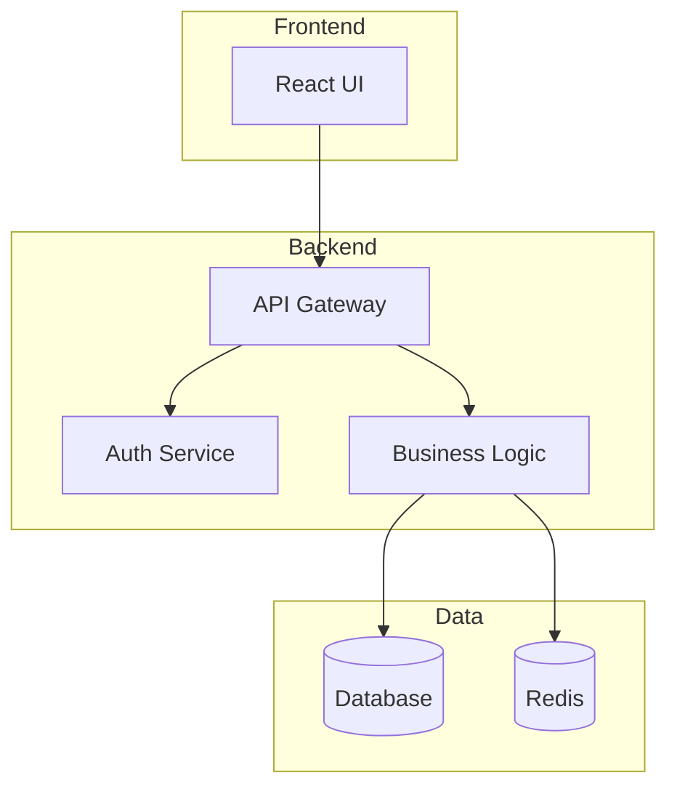
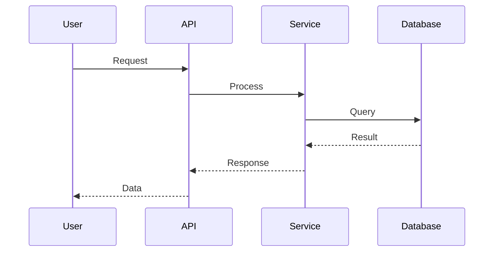

# user-docs-update

Keep documentation current with the latest project structure, business logic, component overviews, and visual diagrams.

## Implementation

1. **Create task plan**:
   - Use TodoWrite to create structured task list
   - Break down documentation updates into discrete tasks
   - Organize by documentation type and priority
   - Track progress through completion

2. **Analyze project structure**:
   - Check for build tool configurations (`package.json`, `justfile`, etc.)
   - Extract available commands and scripts
   - Map component architecture
   - Identify service boundaries

3. **Deploy documentation agents**:
   - **Structure Agent**: Analyze current project organization
   - **Business Logic Agent**: Extract core business rules and flows
   - **Component Agent**: Map component relationships and dependencies
   - **Diagram Agent**: Identify outdated or missing visual representations

4. **Execute tasks systematically**:
   - Mark each task as in_progress before starting
   - Update documentation sections with current findings
   - Complete tasks and mark as completed
   - Update todo list with any new discoveries

5. **Update documentation sections**:
   - **README.md**: Commands, quick start, project overview
   - **Component Overviews**: Purpose, interfaces, dependencies
   - **Business Logic**: Core rules, workflows, decision trees
   - **Architecture Diagrams**: System design, data flow, component interactions

6. **Update or create Mermaid diagrams**:
   - Component architecture diagrams
   - Sequence diagrams for key workflows
   - State diagrams for business processes
   - Entity relationship diagrams

7. **Validation and completion**:
   - Verify documentation matches current code
   - Ensure diagrams reflect actual implementation
   - Check for outdated business rules
   - Mark all tasks as completed

## Documentation Types to Update

### Component Documentation
```markdown
## Component: UserService

**Purpose**: Manages user authentication and profile operations

**Key Methods**:
- `authenticate()` - Validates credentials
- `createUser()` - Registers new users
- `updateProfile()` - Updates user information

**Dependencies**:
- DatabaseService
- CacheService
- EmailService
```

###  Business Logic Documentation
```markdown
## Order Processing Logic

1. **Validation Phase**
   - Check inventory availability
   - Verify payment method
   - Validate shipping address

2. **Processing Phase**
   - Reserve inventory
   - Process payment
   - Generate order number

3. **Fulfillment Phase**
   - Create shipping label
   - Update inventory
   - Send confirmation email
```

### 📊 Mermaid Diagrams


## Example Usage

```text
User: /user-docs-update
Assistant: I'll analyze your project and update all documentation to reflect current implementation.

Deploying documentation analysis agents...

[Structure Agent]
Found:
- 5 main services
- 12 API endpoints
- 3 background workers

[Business Logic Agent]
Identified business flows:
- User registration with email verification

## Boundaries & Scope
- Documentation updates only; do not change code or APIs
- Prefer updating README and command files; avoid creating new docs trees
- Diagrams must reflect actual implementation (no speculative designs)

## Repo Conventions
- Follow `CLAUDE.md` for documentation structure and tone
- Keep core documentation in `README.md` with concise linking
- Ensure commands remain self-documenting with clear usage

## Task List References
- Use `TodoWrite` to track documentation update tasks in `tasks.md`
- Add follow-ups for any discovered gaps or inconsistencies

## Templates/Reports
```markdown
### Docs Update Summary
- Components updated:
- Diagrams updated:
- Business rules adjusted:
- Code references validated:
- Remaining gaps:
```

---
- Order processing with inventory check
- Payment processing with retry logic

[Component Agent]
Mapped relationships:
- UserService → AuthMiddleware → API
- OrderService → InventoryService → Database
- PaymentService → External Gateway

[Diagram Agent]
Outdated diagrams:
- System architecture (missing new cache layer)
- Order flow (doesn't show retry logic)
- Missing: Payment state diagram

Updating documentation...

README.md:
✅ Updated available commands
✅ Added new service descriptions

docs/components/:
✅ Updated UserService overview
✅ Added CacheService documentation
✅ Updated service dependency matrix

docs/business-logic/:
✅ Updated order processing flow
✅ Added payment retry logic
✅ Documented new validation rules

docs/diagrams/:
✅ Updated system architecture diagram
✅ Created payment state diagram
✅ Fixed order sequence diagram

Example updated diagram:


## 📊 Diagram Templates

### 🏗️ Component Architecture


### 🔄 Sequence Diagram


## Notes

- Keeps all documentation synchronized with code
- Updates business logic documentation automatically
- Maintains visual diagrams using Mermaid
- Ensures component overviews match implementation
- Validates documentation accuracy against current code
